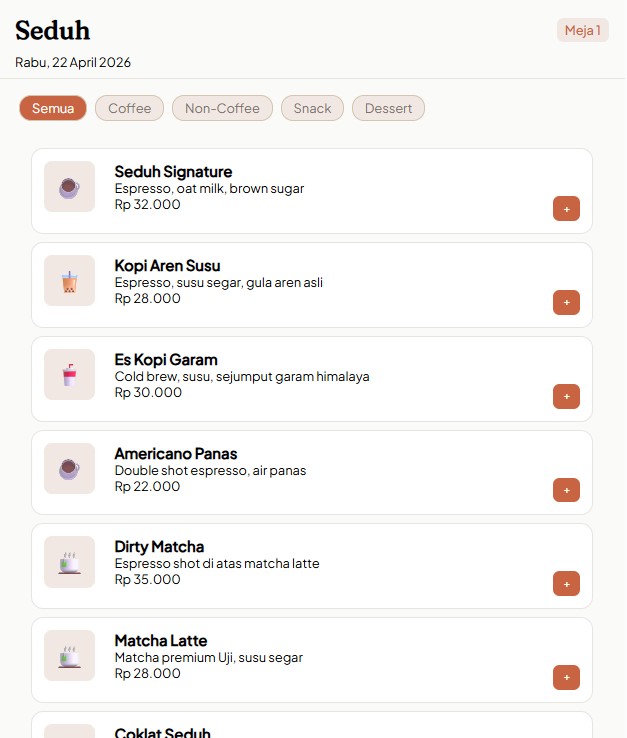
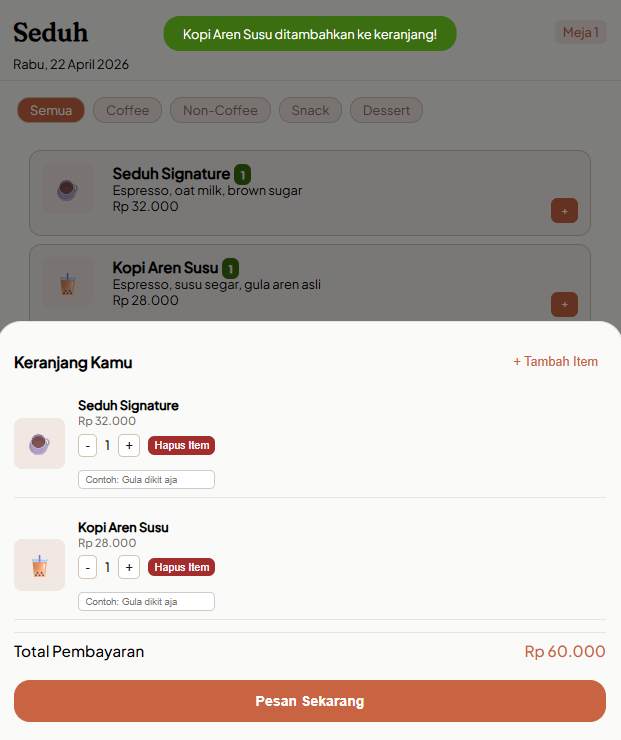
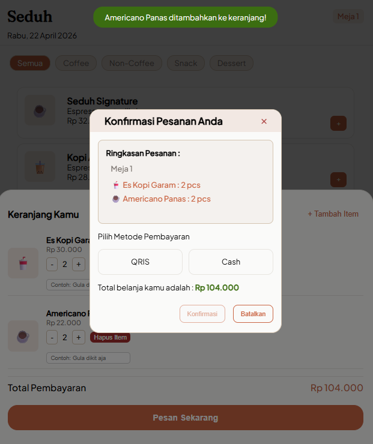
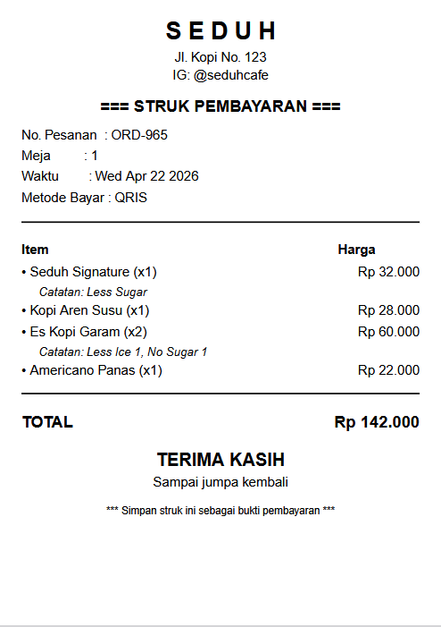

# ☕ Seduh - Aplikasi Pemesanan Menu Kafe (Full-Stack)

**Seduh** adalah aplikasi pemesanan menu kafe **full-stack** yang dirancang untuk digunakan langsung oleh pelanggan melalui tablet atau perangkat di setiap meja. Aplikasi ini mencakup frontend interaktif, backend REST API, database SQLite, dan fitur generate struk PDF.

---

## 🚀 Live Demo

🔗 **Frontend:** [https://seduh.vercel.app](https://seduh.vercel.app)  
🔗 **Backend API:** `http://localhost:5000` _(jalan secara lokal)_

---

## 📸 Screenshot

## ✨ Fitur Utama

### 🖥️ Frontend (Pelanggan)

- **Menu dinamis** — Data diambil dari backend API
- **Filter kategori** — Coffee, Non-Coffee, Snack, Dessert
- **Keranjang interaktif** — Tambah/kurang/hapus item, catatan per item
- **Highlight menu** — Badge quantity pada item yang sudah dipilih
- **Nomor meja dinamis** — Dibaca dari URL query parameter (`?meja=X`)
- **Metode pembayaran** — QRIS (dengan QR Code) & Cash
- **Toast notification** — Feedback visual untuk setiap aksi
- **Responsive design** — Mobile-first, CSS Variables

### 🔧 Backend (Server)

- **REST API** — Endpoint untuk menu, pesanan, dan struk
- **Validasi ganda** — Frontend + Backend validation
- **Database SQLite** — Penyimpanan pesanan permanen
- **Generate struk PDF** — Auto-download setelah konfirmasi pesanan
- **CORS enabled** — Siap diakses dari frontend berbeda domain

---

## 🛠️ Teknologi yang Digunakan

| Layer              | Teknologi                                      |
| ------------------ | ---------------------------------------------- |
| **Frontend**       | HTML5, CSS3, JavaScript (Vanilla, ES6 Modules) |
| **Backend**        | Node.js, Express.js                            |
| **Database**       | SQLite3                                        |
| **PDF Generation** | PDFKit                                         |
| **QR Code**        | [QR Server API](https://goqr.me/api/)          |
| **Fonts**          | Google Fonts (Fraunces, Plus Jakarta Sans)     |

## 🧾 Fitur E-Receipt PDF

Setelah konfirmasi pesanan, file struk PDF akan otomatis terdownload. Struk berisi:

- Logo & informasi kafe
- Nomor pesanan, meja, waktu, metode bayar
- Daftar item + quantity + harga
- Catatan per item (jika ada)
- Total pembayaran

# Contoh E-Receipt Yang Dihasilkan

## 📡 API Endpoints

| Method | Endpoint             | Deskripsi                                  |
| ------ | -------------------- | ------------------------------------------ |
| GET    | /                    | Health check server                        |
| GET    | /api/menu            | Mengambil daftar menu                      |
| GET    | /api/pesanan         | Mengambil semua pesanan (untuk monitoring) |
| POST   | /api/pesanan         | Membuat pesanan baru                       |
| GET    | /api/struk/:id_struk | Download struk PDF                         |

# 🔮 Pengembangan Selanjutnya

- Dashboard Admin/Kasir (monitoring pesanan real-time)
- Update status pesanan (diproses → selesai)
- Autentikasi login admin
- Notifikasi WebSocket untuk pesanan baru
- Deploy backend
- Environment Variables (.env) untuk konfigurasi

## 👨‍💻 Author

Rian Arip Nugraha
